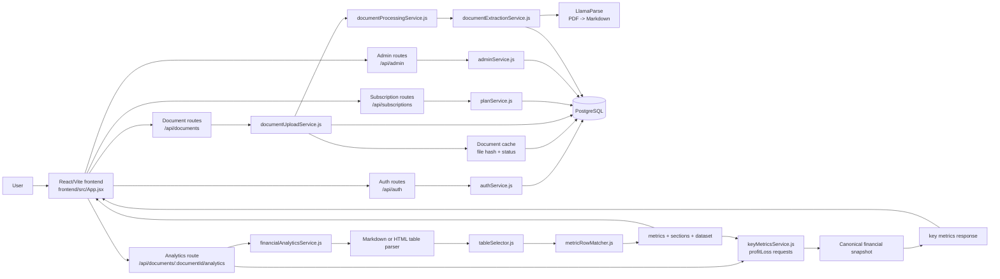
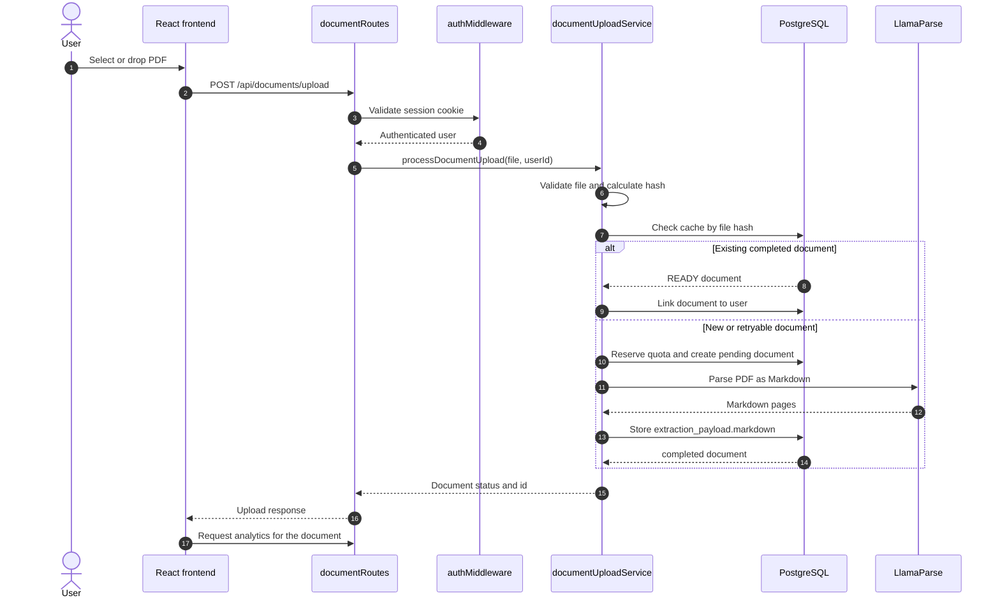
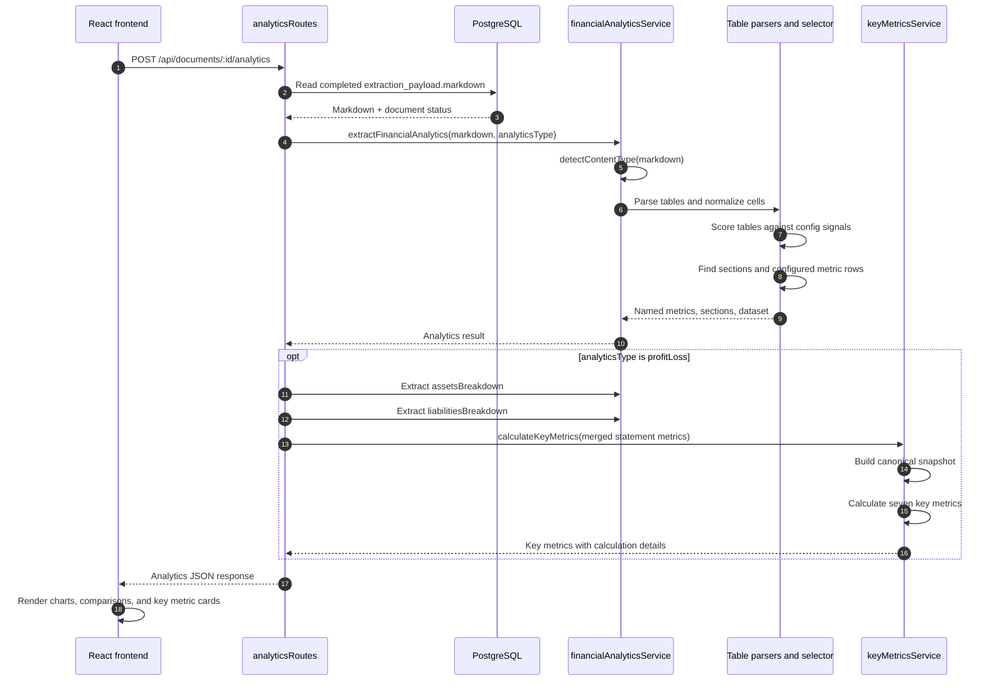
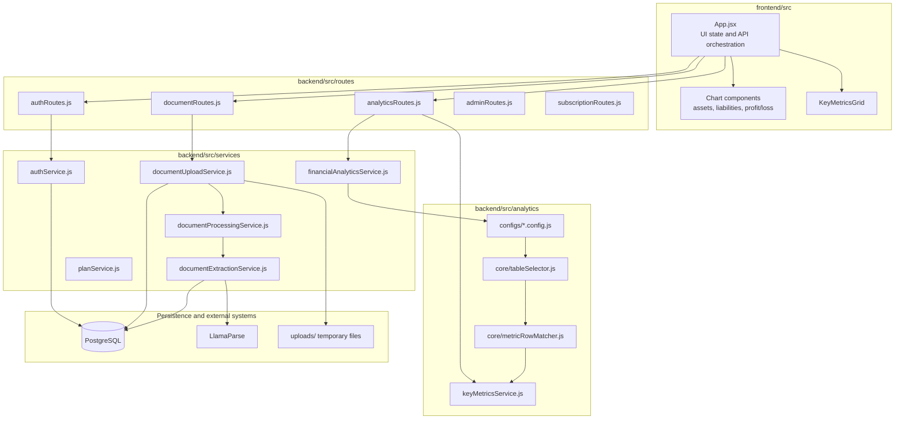

# Financial Analyzer Architecture and Analytics Flow hi

This describes the current implementation across `frontend` and `backend`, from an uploaded PDF to financial analytics and key metrics.

## Architecture At A Glance



## Request Lifecycles

### Upload And Extraction



### Analytics And Key Metrics



## Ownership Map



The diagrams show the primary production path. Market data, OCR proof-of-concept routes, subscription checkout, and admin operations are connected through `server.js` but are intentionally kept outside the core PDF-to-analytics path.

## Flow

```text
PDF upload
  -> documentRoutes POST /upload
  -> processDocumentUpload()
  -> processPendingDocument()
  -> parsePdfWithLlamaParse(resultType: "markdown")
  -> documents.extraction_payload.markdown

POST /documents/:documentId/analytics
  -> read completed extraction_payload.markdown
  -> extractFinancialAnalytics({ markdown, analyticsType })
  -> detectContentType()
  -> parseMarkdownTables() or extractHtmlTables()
  -> selectTables() / scoreTable()
  -> findConfiguredSections()
  -> findMetricRows()
  -> named metrics and validated-section dataset
  -> calculateKeyMetrics() [profitLoss request only]
  -> canonical financial snapshot
  -> key-metric calculations
  -> final API response
```

## Stages

### 1. PDF input and extraction

`src/routes/documentRoutes.js` accepts the PDF at `POST /upload` and passes it to `processDocumentUpload()` in `src/services/documentUploadService.js`. After file validation, hashing, cache handling, and creation/reuse of the document record, `processPendingDocument()` calls `parsePdfWithLlamaParse()` in `src/services/documentExtractionService.js`.

`src/services/llamaParseService.js` calls LlamaParse with `resultType: "markdown"`. The returned pages are joined into one Markdown string. `markDocumentCompleted()` stores `{ parser, markdown, pageCount }` in `documents.extraction_payload`. The analytics route does not parse a PDF itself.

### 2. Entering the analytics framework

`src/routes/analyticsRoutes.js` handles `POST /documents/:documentId/analytics`. It reads the completed document's `extraction_payload.markdown`, then calls `extractFinancialAnalytics()` from `src/services/financialAnalyticsService.js`.

For a `profitLoss` request, the route also runs `assetsBreakdown` and `liabilitiesBreakdown`, merges their metric objects, and calls `calculateKeyMetrics()` from `src/analytics/services/keyMetricsService.js`.

### 3. Table discovery and parsing

`financialAnalyticsService.js` uses `detectContentType()` and `extractTablesFromContent()`. Markdown table blocks are discovered by `parseMarkdownTables()` in `src/parser/markdownTableParser.js`; HTML tables use `extractHtmlTables()` in `src/parser/htmlTableParser.js`. Both produce tables with headers, rows, cell `.text` values, and table dimensions.

Parsing only discovers table structure. It does not classify statements or name financial metrics.

### 4. Table selection

`selectTables()` and `scoreTable()` in `src/analytics/core/tableSelector.js` score every discovered table against the selected analytics config. Required/preferred signal groups are matched against table text. When metrics exist in the config, the score is `40%` signal score and `60%` configured-metric coverage. The highest positive-scoring table is selected.

The configs are loaded by `analyticsConfigLoaders` in `financialAnalyticsService.js`:

- `src/analytics/configs/profitLoss.config.js` -> `profitLossConfig`
- `src/analytics/configs/assetsBreakdown.config.hybrid.js` -> `assetsBreakdownConfig`
- `src/analytics/configs/liabilitiesBreakdown.config.hybrid.js` -> `liabilitiesBreakdownConfig`
- `src/analytics/configs/cashFlow.config.js` -> `cashFlowConfig`

### 5. Configured matching and named metrics

Each config has `tableSelection` signals and a `metrics` object. Each metric has a code-facing name, a `role`, and `aliases`. For example, `profitLossConfig.metrics.revenueFromOperations.aliases` includes `revenue from operations`, `revenue`, `net sales`, `sales`, and `turnover`.

`findConfiguredSections()` in `src/analytics/core/metricRowMatcher.js` finds section boundaries from the config's required signal groups. `findMetricRows()` then searches configured sections, prefers valid numeric rows and exact label matches, and supports configured aggregate/structural resolution rules.

For each configured metric with values, `extractFinancialAnalytics()` creates a named entry in `metrics`, including numeric `values` keyed by detected year/period and source metadata such as row index, label, section, role, and resolution. A configured metric with no usable match is still represented with empty values and `resolution.status: "unresolved"`; it is listed in `summary.missingMetrics` and `summary.unresolvedMetrics`.

### 6. Rows not configured as metrics

Rows are not discarded merely because they have no metric alias. `discoverSectionRows()` retains non-empty rows inside validated sections when they have a label or numeric year values. `buildAnalyticsDataset()` emits those rows with `inclusionReason: "source row within validated section"`, the default `role: "detail"`, and an empty `metricNames` array.

Rows outside discovered sections are not retained in the analytics dataset. The table itself is still reported through its table metadata. Thus, `dataset` is not a copy of the selected raw table and is not a list of configured metrics only.

### 7. Analytics dataset

The returned analytics object contains `metrics`, `sections`, and `dataset`. The dataset is built from `sections.flatMap(section => section.rows)`. It retains each selected-section row's label, numeric values, source row/section indexes, source total, calculated percentages where a section total exists, role, and configured metric names. A row matched to a configured metric is annotated as `matched configured metric within validated source section`; an unmatched retained row remains available as a detail/source row.

### 8. Canonical snapshot

There is no database-persisted key-metric snapshot. `createCanonicalFinancialSnapshot()` in `src/analytics/services/keyMetricsService.js` creates an in-memory snapshot at the start of `calculateKeyMetrics()`.

The normal statement sources are explicitly limited to:

- Profit/loss: `revenueFromOperations`, `profitAfterTax`, `profitBeforeTax`, `financeCosts`, `depreciationAndAmortisation`
- Balance sheet: `totalCurrentAssets`, `totalCurrentLiabilities`, `totalAssets`, `totalEquity`, `totalBorrowings`

The snapshot reads those fields from the passed statement metrics, or from the merged `financialAnalytics.metrics` supplied by `analyticsRoutes.js`. In the legacy single-object input form, it also carries `longTermBorrowings` and `shortTermBorrowings` for the debt fallback. `snapshotMetrics()` flattens the snapshot into the metric shape consumed by the calculation functions.

### 9. Key-metric inputs and calculations

`calculateKeyMetrics()` calls the seven calculation functions with only the snapshot-derived `metrics` object. `addCalculationDetails()` adds the actual input values, periods, formula, and derived values to each result.

| Key metric | Actual input fields | Calculation |
| --- | --- | --- |
| `revenueGrowth` | `revenueFromOperations` | `(current revenue - previous revenue) / previous revenue * 100` |
| `netProfitMargin` | `profitAfterTax`, `revenueFromOperations` | PAT / revenue * 100 |
| `ebitdaMargin` | `profitBeforeTax`, `financeCosts`, `depreciationAndAmortisation`, `revenueFromOperations` | `(PBT + finance costs + depreciation) / revenue * 100` |
| `currentRatio` | `totalCurrentAssets`, `totalCurrentLiabilities` | current assets / current liabilities |
| `debtToEquity` | `totalBorrowings`, `totalEquity` | borrowings / equity |
| `roe` | `profitAfterTax`, `totalEquity` | PAT / average current and previous equity * 100 |
| `roa` | `profitAfterTax`, `totalAssets` | PAT / average current and previous assets * 100 |

`debtToEquity` uses `totalBorrowings` when present. If it is absent, `calculateDebtToEquity()` and the calculation-detail logic can add `longTermBorrowings` and `shortTermBorrowings` when either is available. Missing values or zero denominators produce an `unavailable` result where the function's rules require it.

## Example: Revenue row to Revenue Growth

Given the existing test input in `debug/keyMetricsService.test.js`:

```text
| Particulars              | 2024     | 2025     |
| Revenue from operations  | 10876.85 | 21167.24 |
```

1. `parseMarkdownTables()` creates the table and normalizes cells to `{ text }`.
2. `profitLossConfig.tableSelection.requiredSignals` selects the table as the income/revenue and expenses table. `revenueFromOperations` matches the row through its alias.
3. `extractMetricValues()` converts the row to `{ "2024": 10876.85, "2025": 21167.24 }` and stores it under `analytics.metrics.revenueFromOperations`.
4. `calculateKeyMetrics()` copies that configured field into the canonical snapshot. It resolves `2025` as current and `2024` as previous.
5. `calculateRevenueGrowth()` returns `94.6` (rounded), with the source periods and values included in the result.

## Future Developer Rule

A key metric may consume only a financial field that is explicitly configured, extracted into the analytics result, and admitted by the canonical snapshot. Adding a new key metric that needs a currently unconfigured value requires updating the owning analytics config aliases/metric entry, ensuring that analytics route supplies that source, adding the field to `canonicalSources` (and the dependency/calculation definitions), and implementing its calculation input path in `keyMetricsService.js`. Do not make a key metric read raw table rows or arbitrary dataset rows directly; the canonical snapshot is the source boundary.
