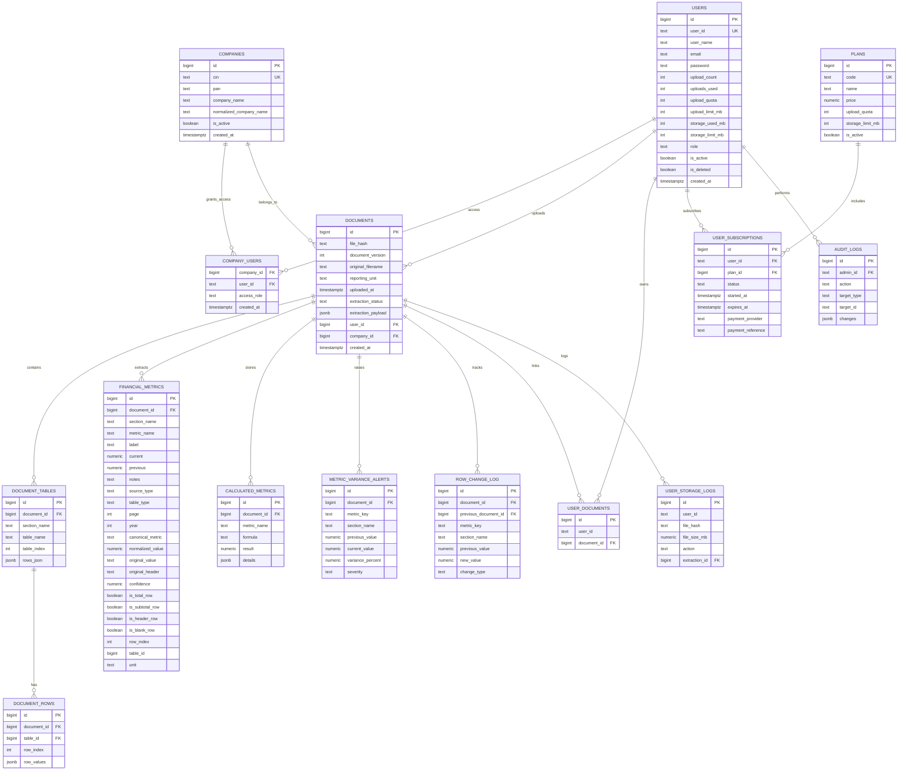

# Database Schema Overview

## Key idea

The core flow is:

`users` -> `companies` -> `documents` -> `document_tables` -> `document_rows` -> `financial_metrics`

This database stores:

- user/company access
- uploaded PDFs and cached extraction payloads
- parsed tables and rows
- extracted financial metrics
- comparison alerts and change logs
- subscription and quota tracking
- admin audit trail
0000000000000000000000000000000000000000000000000
00000000000000000000000000000000000000000000000000
cd "C:\Users\HP\Desktop\balcnce sheet poc\balancesheet_backend"

py -3 -m venv .venv
.\.venv\Scripts\Activate.ps1

python -m pip install --upgrade pip
python -m pip install streamlit pandas psycopg2-binary python-dotenv llama-parse

streamlit run poc/streamlit_financial_app.py --server.port 8501

Set-ExecutionPolicy -Scope Process -ExecutionPolicy Bypass
.\.venv\Scripts\Activate.ps1
